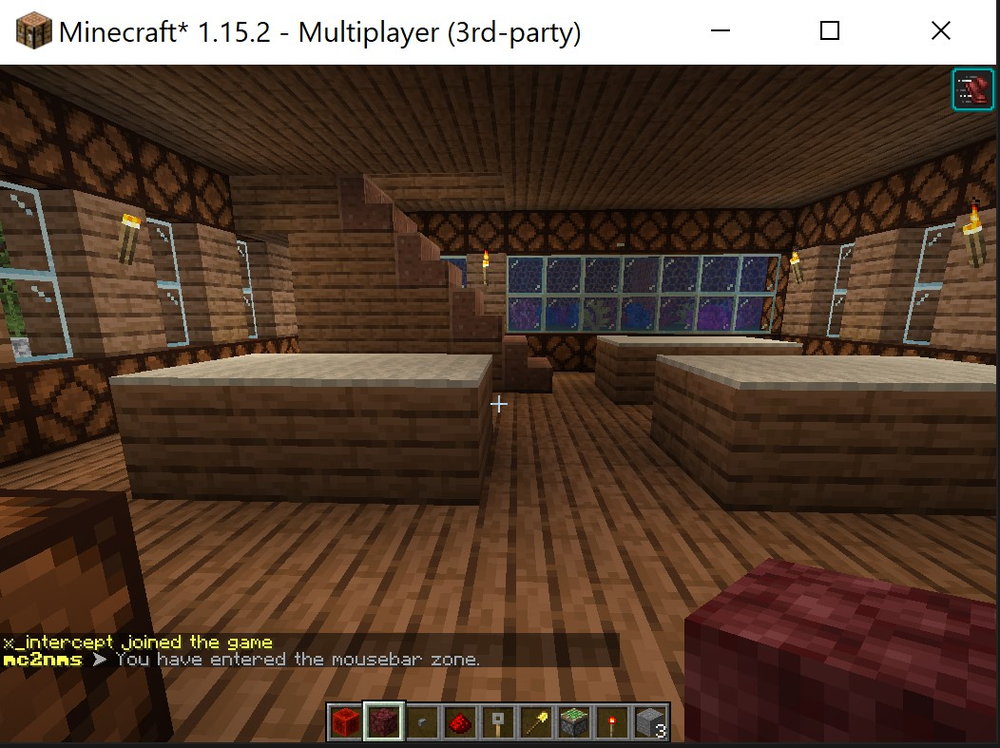

# mc2nms

This plugin is going to watch certain "zones" or areas and send events to OpenNMS when players enter or leave the zones.



These events can then be used to generate alarms and/or used to drive complex event processing (CEP) w/ Drools.

> See the `etc/` folder for related OpenNMS artifacts

Events can be sent to multiple OpenNMS servers simulatenously.
They are defined the configuration as follows:
```
opennms:
  local:
    baseurl: http://localhost:8980/opennms
    username: admin
    password: admin
```

Zones are tracked as cylinders and the defined as follows in the configuration:
```
zones:
  secretbutton:
    world: "world"
    x: 519.700
    y: 83.000
    z: -1166.700
    radius: 2.0
    height: 2.0
```

* x,y,z sets the coordinate of the center of the cylinders base
* radius & height are related to the center

